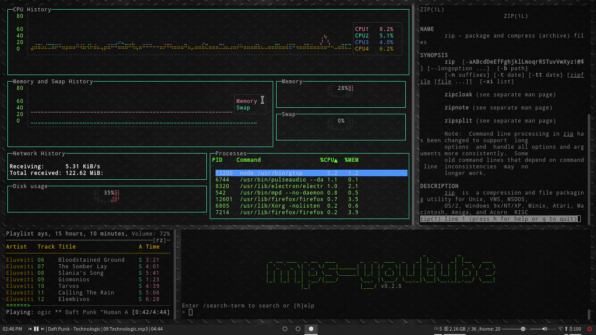
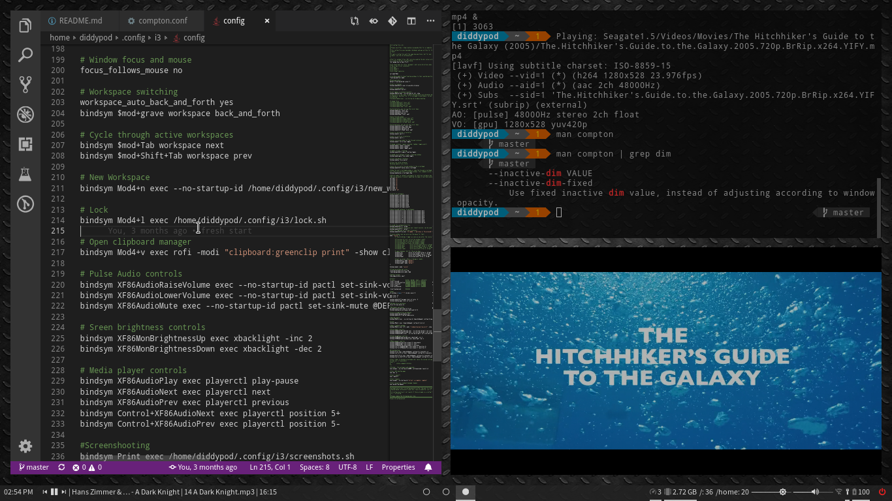
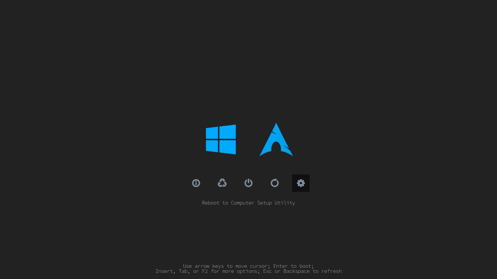

# diddypod's arch config [ i3 + polybar + compton + rofi ]

.config and other files for a setup that looks like this, plus some functional niceties.

Scripts for small tasks at [scripts](scripts).

For a pretty sweet bootloader theme, check out [refind-theme-regular](https://github.com/bobafetthotmail/refind-theme-regular).

